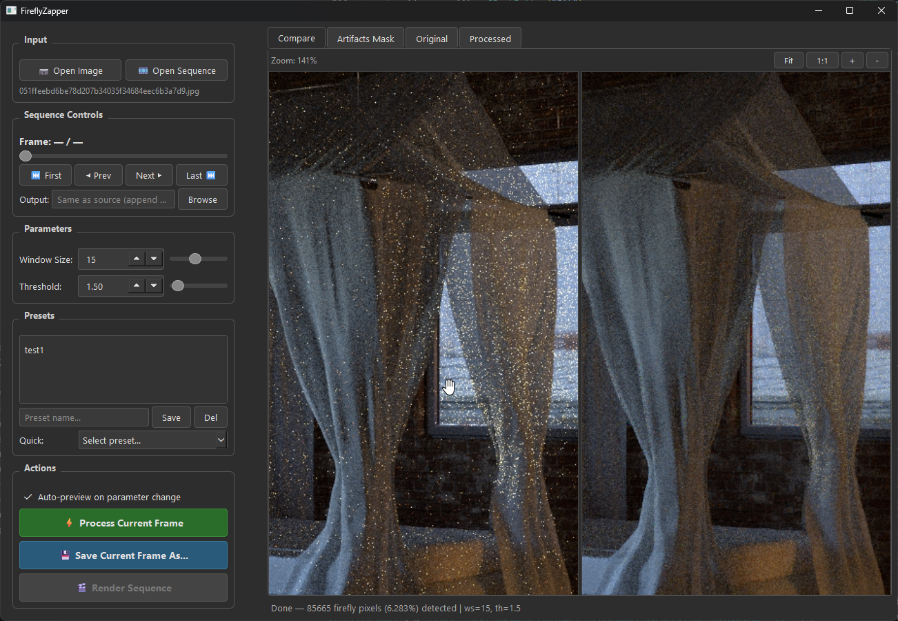

# FireflyZapper

[](assets/screenshot.png)

## Overview

FireflyZapper removes fireflies (hot pixels, bright spots, or specular artifacts) from images using local statistics and z-score thresholding. It comes with both a **graphical user interface (GUI)** and a **command-line interface (CLI)**.

## Features

- **Local Statistics**: Uses local mean and standard deviation to compute z-scores for each pixel.
- **Z-Score Thresholding**: Identifies fireflies based on a customizable z-score threshold.
- **Median Filtering**: Replaces detected firefly pixels with median-filtered values from their neighborhood.
- **Supports Grayscale, Color Images, and EXR Format**: Processes each color channel separately to handle color images effectively. Additionally, it supports high dynamic range (HDR) images in the EXR format.
- **Graphical User Interface** (`zap_gui.py`): PySide6-based GUI with interactive previews, zoom/pan, preset management, and sequence processing.
- **Sequence Processing**: Load an entire folder of images, scrub through frames, and batch-render the whole sequence.
- **Preset Management**: Save/load/delete parameter presets for quick switching between configurations.

## Installation

### Requirements

- Python 3.8+
- Dependencies listed in `requirements.txt`

### Setup

```bash
# Clone the repository
git clone https://github.com/aroslanov/FireflyZapper.git
cd FireflyZapper

# Create a virtual environment (recommended)
python -m venv .venv

# Activate it
# Windows:
.venv\Scripts\activate
# Linux/Mac:
source .venv/bin/activate

# Install dependencies
pip install -r requirements.txt
```

## GUI Usage

Launch the GUI with:

```bash
python zap_gui.py
```

### Interface Overview

The GUI is organized into a left control panel and a right preview area with four tabs:

| Tab | Description |
|-----|-------------|
| **Compare** | Side-by-side view of original and processed images with synced zoom/pan |
| **Artifacts Mask** | Shows detected fireflies overlaid in red on the original image |
| **Original** | Full-size view of the original image (zoomable) |
| **Processed** | Full-size view of the processed result (zoomable) |

### Controls

- **Input**: Open a single image or an entire sequence folder.
- **Sequence Controls**: Frame slider, navigation buttons (First/Prev/Next/Last), output directory picker, and render progress bar.
- **Parameters**: Adjust window size (3–31) and threshold (0.5–20.0) via sliders or spin boxes.
- **Presets**: Save current parameters as named presets, or use quick presets (Mild / Medium / Aggressive / Very Aggressive).
- **Actions**: Auto-preview on parameter change, process current frame, save result, or render the full sequence.
- **Zoom**: Use the zoom toolbar (Fit / 1:1 / + / -) or scroll-wheel to zoom, click-and-drag to pan.

### Sequence Rendering

1. Click **Open Sequence** and select a folder containing images.
2. Scrub through frames using the slider or navigation buttons.
3. Adjust parameters — changes auto-preview on the current frame.
4. Optionally set a custom output directory, or leave blank to create a `_processed` folder next to the source.
5. Click **Render Sequence** to batch-process all frames in a background thread.

## CLI Usage

The CLI script can be run from the command line with the following syntax:

```bash
python zap.py <input> <output> [--window_size <size>] [--threshold <value>]
```

### Arguments

- `<input>`: The path to the input image file or directory. Supported formats include JPEG, PNG, BMP, and EXR for images.
  - If a single image is provided, it will be processed and saved as specified by the output argument.
  - If a directory is provided, all supported images in that directory will be processed, and the results will be saved to the output directory or prefixed with the specified prefix.

- `<output>`: The path where the processed image(s) will be saved. This can be either:
  - A file path if a single input image is provided.
  - A directory path if an input directory is provided. If this is the same as the input directory, you will be prompted to choose between creating a new output directory, adding a prefix to the output files, or overwriting the source files.

- `--window_size <size>`: (Optional) The size of the window used for local statistics calculations. Must be an odd integer (default is 5). Larger windows can smooth out more noise but may also remove smaller details.

- `--threshold <value>`: (Optional) The z-score threshold for firefly detection. Pixels with z-scores above this value are considered fireflies and will be replaced (default is 3.0).

### CLI Examples

```bash
# Process a single image
python zap.py input.jpg output.png --window_size 7 --threshold 2.5

# Process all images in a directory
python zap.py images processed_images --window_size 9 --threshold 3.5

# Add a prefix to output filenames
python zap.py images images --prefix clean_
```

## How It Works

1. **Reading the Image**: The script reads the input image using OpenCV or `OpenEXR` for EXR files.
2. **Processing Channels**: If the image is color, it splits the image into its RGB channels and processes each channel separately.
3. **Local Statistics Calculation**: For each channel (or the entire image if grayscale), local mean and standard deviation are calculated using a specified window size.
4. **Z-Score Computation**: The z-score for each pixel is computed based on the local statistics.
5. **Firefly Detection**: Pixels with z-scores above the threshold are identified as fireflies.
6. **Median Filtering**: A median filter is applied to the entire channel (or image).
7. **Replacement**: Detected firefly pixels are replaced with the corresponding values from the median-filtered result.
8. **Saving the Result**: The processed image is saved to the specified output path.

## Contributing

Contributions to this project are welcome! If you have any improvements, bug fixes, or additional features you'd like to add, feel free to fork the repository and submit a pull request. Please ensure your changes adhere to the project's coding standards and include appropriate documentation.

## License

This script is released under the MIT License. See the [LICENSE](LICENSE) file for more details.